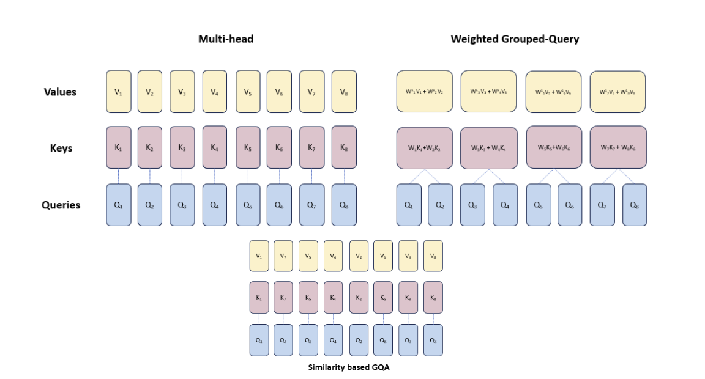
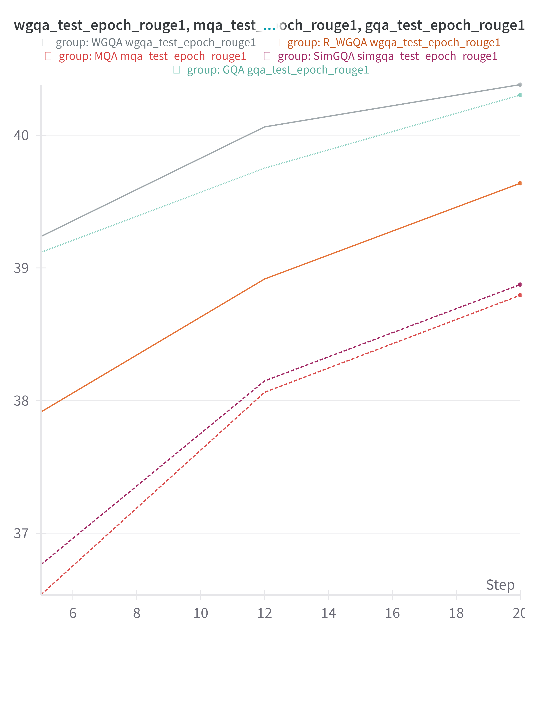

## ENHANCEMENT TO GROUPED-QUERY ATTENTION

### Abstract

The Transformer architecture forms the foundation of large language models. However, with increasing demands for scaling and constraints of hardware memory, the inference costs of these models remain high. To address these challenges, Multi Query Attention (MQA) and Grouped Query Attention (GQA) were proposed by Noam Shazeer et al. in [paper reference 1] and GQA[paper reference]. While MQA uses only one key-value head, GQA uses an intermediate number of key and value heads by averaging adjacent key-value pairs, achieving Multi-Head Attention (MHA) level performance after uptraining for 5-10\% of the original pretraining computation.\\

In this paper, we propose a variation of Grouped-Query Attention, termed Weighted Grouped-Query Attention (WGQA). We introduce new learnable parameters for each key and value head in the decoder attention blocks, enabling the model to take a weighted average during uptraining. Our model demonstrates a performance slightly better than GQA close to traditional MHA with same number of steps. We believe that the introduction of these parameters and subsequent finetuning inform the model about the grouping mechanism during training, thereby enhancing performance in fewer steps.

The Weights and Biases run for all the experiments are [here](https://wandb.ai/athe_kunal/similarity_gqa?workspace=user-)

To reproduce the results, here are some of the files and their description

`t5_SGQA.py`: Implementation of similarity-based Grouped Query Attention. For `similarity_flag=False`, it will be vanilla GQA

`t5_WGQA.py`: Implementation of weighted GQA, where `if_random=True`, it will initilize the standard normal distribution, else with `0.5`

`benchmark`: The benchmark folder has all the script files for running the experiments along with IU shell script files to submit batch jobs

The results for Rouge-1 score for CNN/Daily Mail dataset is as follows

